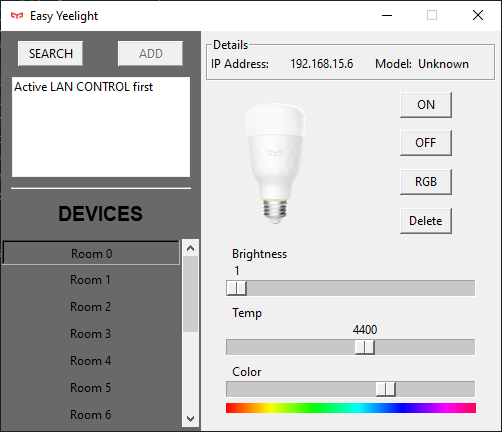

# Description
Easy Yeelight is a simple App designed to control a Xiaomi [Yeelight Color Bulb](https://www.yeelight.com/en_US/product/lemon2-color).

Currently supported features:
* ON/OFF
* Brightness
* Temperature
* HSV Bar
* RGB control
* Scan devices and registration



## Usage and requirements

* First of all, make sure you have enable "Lan Control" on your bulb through the Official YeeLight app.

* Python 3.x

* Install yeelight library using pip:
``` 
pip install yeelight
```
Or Install from [source](https://gitlab.com/stavros/python-yeelight) and do ``python setup.py install``


* Install scapy modulle to allow ping command:
```
pip install scapy
```

* Then run ``.\easyeelight.py`` file to execute the application.

